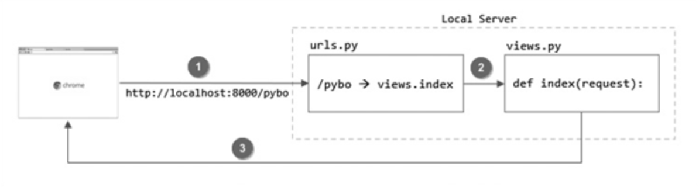

# 프로젝트 시작하기

## 가상환경 설정하기

- django 라이브러리를 다루기 위해서 해당 라이브러리를 저장할 가상 환경 설정이 필요하다

- 가상 환경을 실행하는 명령어는 다음과 같다

```
source django-env(가상환경 이름)/bin/activate
```

## 프로젝트 만들기

- 원하는 디렉토리로 이동 후 프로젝트를 저장할 디렉토리를 하나 만들고 아래 명령어를 통해서 프로젝트를 시작한다

```
mkdir 디렉토리 이름
```

```
django-admin startproject config .
```

## 앱 만들기

- 우리가 지금 만든것은 프로젝트고 프로젝트만으로는 아무것도 할 수 없다. 따라서 앱을 만들어 주어야 한다.

```
djagno-admin startapp 앱 이름
```

# url과 view

## url 설정하기

- config 안에 있는 url에는 프로젝트와 관련된 url들만 들어가야 하기 때문에 include를 이용해서 toDoList로 호출이 들어오면 toDoList에 있는 urls.py 파일로 넘겨준다.

- 이때 urls.py 안에서는 path를 이용해서 요청이 들어온 주소에 따라 views에 있는 적절한 함수를 호출해야 한다.

## 진행 흐름



https://docs.djangoproject.com/en/4.0/ref/models/fields/#field-types